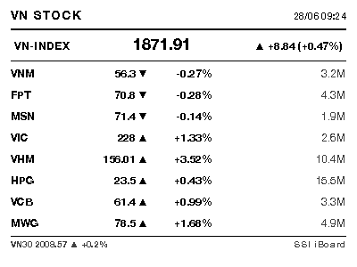

# VN Stock Dashboard — TRMNL Private Plugin

E-ink dashboard hiển thị **VN-Index + 8 cổ phiếu blue chip + VN30** trên màn 400×300 mono (Waveshare ESP32-S3-RLCD-4.2). Data từ **SSI iBoard API** — free, không cần đăng ký, không API key.



---

## Datasource

**SSI iBoard chart history** (`iboard-api.ssi.com.vn`) — endpoint TradingView UDF format, trả về OHLCV array cho 1 ticker / 1 timeframe:

```
GET https://iboard-api.ssi.com.vn/statistics/charts/history
    ?resolution=1D
    &symbol={TICKER}
    &from={UNIX_TS_30_DAYS_AGO}
    &to={UNIX_TS_NOW}
```

Response (verified live):

```json
{
  "code": "SUCCESS",
  "data": {
    "t": [1780012800, 1780272000, ...],
    "o": [57.13, 57.32, ...],
    "h": [57.42, 57.42, ...],
    "l": [57.03, 56.94, ...],
    "c": [57.32, 57.23, ...],
    "v": [1960700, 2259500, ...],
    "s": "ok"
  }
}
```

Trả về tối đa ~21 daily bars trong window 30 ngày.

**Symbols hỗ trợ** (đã verify):

- ✅ Indexes: `VNINDEX`, `VN30`
- ✅ Blue chips HoSE: `VNM`, `FPT`, `MSN`, `VIC`, `VHM`, `HPG`, `VCB`, `MWG`, `TCB`, `BID`, `CTG`, `GAS`, `PLX`, `SAB`, `STB`, `SSI`, ...
- ✅ HNX/UPCOM tickers theo mã (vd `PVS`, `SHS`)
- ❌ `HNX-INDEX`, `UPCOM-INDEX` (chưa tìm được symbol đúng)

---

## Plugin layout (10 sources)

| Source | Symbol | Hiển thị |
|---|---|---|
| `source_1` | VNINDEX | Header hero — last + change + % |
| `source_2..source_9` | 8 user-pickable tickers | Bảng 8 dòng: code · last · ▲▼ · %chg · vol |
| `source_10` | VN30 | Footer mini: VN30 + % chg |

Default 8 tickers: **VNM, FPT, MSN, VIC, VHM, HPG, VCB, MWG**.

---

## Install vào Terminus

### Option A: Import manual (recommended cho self-hosted)

1. **Tạo Extension** trong Terminus:
   - Extensions → **New**
   - Name: `vn_stock_dashboard`
   - Label: `VN Stock Dashboard`
   - Kind: `Poll`
   - Mode: `text`
   - Interval: `30`, Unit: `minute` (refresh mỗi 30 phút)
   - Start at: hôm nay
   - Model: chọn **`waveshare_esp32_s3_rlcd_4_2`** (KHÔNG phải `og_plus`)
   - Save

2. **Paste Template** (từ `liquid/full.liquid`) vào field Template → Save.

3. **Tạo 1 Exchange duy nhất** chứa cả 10 URLs:
   - Mở extension → Exchanges → **New**
   - Verb: `GET`
   - Headers: (trống)
   - Body: (trống)
   - Template (URLs):

     ```
     https://iboard-api.ssi.com.vn/statistics/charts/history?resolution=1D&symbol=VNINDEX&from={{ "now" | date: "%s" | minus: 2592000 }}&to={{ "now" | date: "%s" }}
     https://iboard-api.ssi.com.vn/statistics/charts/history?resolution=1D&symbol=VNM&from={{ "now" | date: "%s" | minus: 2592000 }}&to={{ "now" | date: "%s" }}
     https://iboard-api.ssi.com.vn/statistics/charts/history?resolution=1D&symbol=FPT&from={{ "now" | date: "%s" | minus: 2592000 }}&to={{ "now" | date: "%s" }}
     https://iboard-api.ssi.com.vn/statistics/charts/history?resolution=1D&symbol=MSN&from={{ "now" | date: "%s" | minus: 2592000 }}&to={{ "now" | date: "%s" }}
     https://iboard-api.ssi.com.vn/statistics/charts/history?resolution=1D&symbol=VIC&from={{ "now" | date: "%s" | minus: 2592000 }}&to={{ "now" | date: "%s" }}
     https://iboard-api.ssi.com.vn/statistics/charts/history?resolution=1D&symbol=VHM&from={{ "now" | date: "%s" | minus: 2592000 }}&to={{ "now" | date: "%s" }}
     https://iboard-api.ssi.com.vn/statistics/charts/history?resolution=1D&symbol=HPG&from={{ "now" | date: "%s" | minus: 2592000 }}&to={{ "now" | date: "%s" }}
     https://iboard-api.ssi.com.vn/statistics/charts/history?resolution=1D&symbol=VCB&from={{ "now" | date: "%s" | minus: 2592000 }}&to={{ "now" | date: "%s" }}
     https://iboard-api.ssi.com.vn/statistics/charts/history?resolution=1D&symbol=MWG&from={{ "now" | date: "%s" | minus: 2592000 }}&to={{ "now" | date: "%s" }}
     https://iboard-api.ssi.com.vn/statistics/charts/history?resolution=1D&symbol=VN30&from={{ "now" | date: "%s" | minus: 2592000 }}&to={{ "now" | date: "%s" }}
     ```

     > Terminus's URIBuilder split URLs theo whitespace → mỗi URL thành `source_1..source_10`.
   - Save → tab Data verify cả 10 sources có data, tab Errors trống.

4. **Add to Playlist**:
   - Playlists → Default → + Item → Screen = `VN Stock Dashboard` screen → Position phù hợp.
   - Devices → assign Playlist.

5. **Refresh device** (wake / reset).

### Option B: Import từ TRMNL.com plugin store

(Chưa publish lên store, chỉ option A.)

---

## Customize tickers

Mặc định plugin show VNM/FPT/MSN/VIC/VHM/HPG/VCB/MWG. Đổi sang ticker khác (vd thêm SSI, TCB, BID...):

### Cách 1: Edit Exchange URL list (đơn giản)

Mở Extension → Exchange → Template → thay 8 ticker bên trong URL list (giữ nguyên thứ tự VNINDEX + 8 ticker + VN30).

Đồng thời edit **Liquid template** (field Template của Extension) → thay 8 default trong block ``:

```liquid

                                                                                              ^^^
                                                                                              đổi đây
```

### Cách 2: Dùng Custom Fields t1..t8 (nếu Terminus của bạn hỗ trợ)

Hiện Terminus's UI có thể hoặc không có Custom Fields editor cho extension tự tạo. Nếu CÓ:

1. Mở extension → tab Fields → fill 8 ô `t1..t8` với mã ticker.
2. Save → URL template auto-render với mã mới (nhờ Liquid `{{ ... | default: 'VNM' }}` fallback).

Nếu KHÔNG → dùng Cách 1.

---

## Refresh schedule

Plugin set `interval=30, unit=minute` — refresh **mỗi 30 phút**.

Lý do: VN market giao dịch 9:00–11:30 + 13:00–15:00 ICT (Mon–Fri). Refresh 30 phút đủ "fresh" cho dashboard mà không vắt kiệt SSI server.

Để tiết kiệm pin board hơn, tăng lên 60 phút trong giờ giao dịch. Ngoài giờ giao dịch / cuối tuần data không đổi → board sẽ render image y hệt → board sẽ skip download nhờ checksum match.

> ⚠️ Verify Sidekiq worker đang chạy trên VPS, không thì cron không fire:
>
> ```bash
> docker compose ps     # phải thấy 'worker' Up
> ```

---

## Troubleshoot

| Triệu chứng | Nguyên nhân & Fix |
|---|---|
| Bảng trống hết 8 ticker | Exchange chưa fetch. Kiểm tra tab Errors. |
| 1-2 dòng trống "no data" | Ticker đó không tồn tại hoặc bị typo. Verify bằng curl manual. |
| Time hiện sai timezone | Template hardcode UTC+7 (`plus: 25200`). Đổi số này nếu múi giờ khác. |
| Image cũ không refresh | Sidekiq worker chưa chạy. `docker compose up -d worker`. |
| Cropped trên board | Browser của Terminus có thể render với default font khác. Verify `<style>` block đã apply. |
| 503/504 từ SSI | SSI server overload (hiếm). Plugin sẽ retry ở refresh tiếp theo. |

---

## File layout

```
firmware-extras/trmnl-vn-stock/
├── README.md                  ← bạn đang đọc
├── liquid/
│   ├── settings.yml           ← plugin manifest (TRMNL plugin format)
│   └── full.liquid            ← display template 400×300
└── preview/
    ├── full.html              ← rendered HTML preview (live data)
    └── full.png               ← 400×300 screenshot
```

---

## License

MIT. Free to fork/remix.
